# UFO Files Graph Builder

A static graph builder for completed OCR and media transcripts in the UFO Files archive. It is designed for GitHub Pages: there is no server, database, CDN dependency, or runtime build step.

Portuguese-first Brazil records are cataloged from exactly one language per
build: reviewed English derivatives by default, or canonical Portuguese with
`--paired-language pt-BR`. The document finder exposes both paths and the
translation review status. Failed translations are excluded, and Portuguese
and English never enter entity or event counts as duplicate segments.

## Graph types

These previews are regenerated from the latest machine-data catalog after every successful rebuild. The default view includes the full app chrome, while each graph-type preview focuses on the graph itself. Every image includes a 1px black border for contrast against light backgrounds.

<!-- graph-screenshots:start -->
<p align="center">
  <strong>Default view</strong><br>
  <a href="assets/screenshots/default-view.png"></a>
</p>
<table>
  <tr>
    <td width="50%" align="center">
      <strong>Network</strong><br>
      <a href="assets/screenshots/network.png"></a>
    </td>
    <td width="50%" align="center">
      <strong>Map</strong><br>
      <a href="assets/screenshots/map.png"></a>
    </td>
  </tr>
  <tr>
    <td width="50%" align="center">
      <strong>Galactic Entities</strong><br>
      <a href="assets/screenshots/solar.png">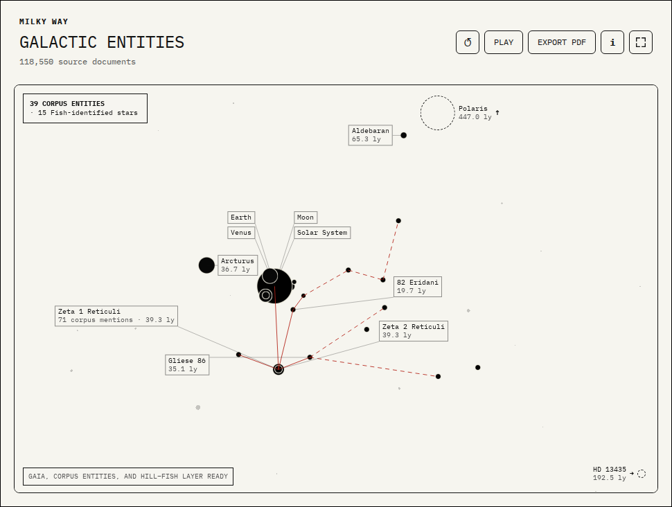</a>
    </td>
    <td width="50%" align="center">
      <strong>Bookshelf</strong><br>
      <a href="assets/screenshots/book.png"></a>
    </td>
  </tr>
  <tr>
    <td width="50%" align="center">
      <strong>Documents</strong><br>
      <a href="assets/screenshots/document.png"></a>
    </td>
    <td width="50%" align="center">
      <strong>Craft</strong><br>
      <a href="assets/screenshots/craft.png">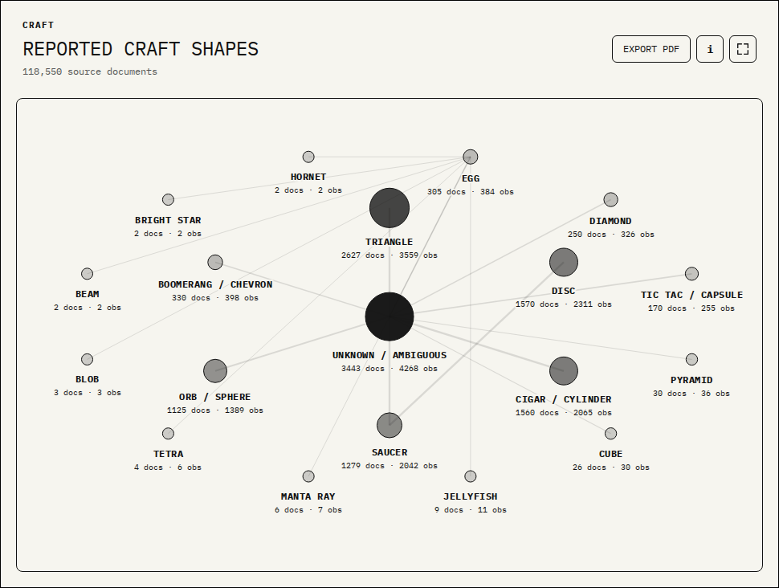</a>
    </td>
  </tr>
  <tr>
    <td width="50%" align="center">
      <strong>Species</strong><br>
      <a href="assets/screenshots/species.png">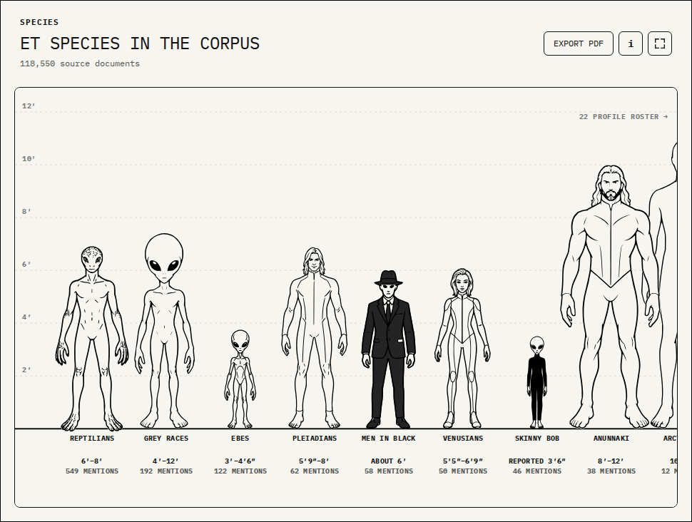</a>
    </td>
    <td width="50%" align="center">
      <strong>Signals</strong><br>
      <a href="assets/screenshots/signals.png">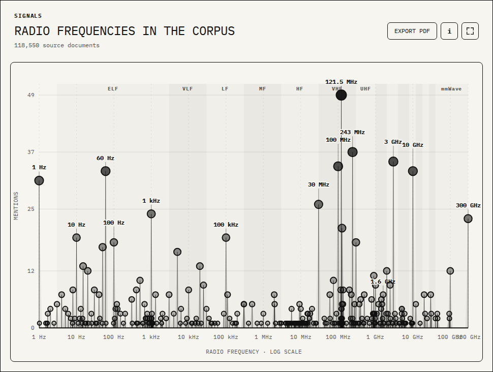</a>
    </td>
  </tr>
  <tr>
    <td width="50%" align="center">
      <strong>Scatter</strong><br>
      <a href="assets/screenshots/scatter.png"></a>
    </td>
    <td width="50%" align="center">
      <strong>Bars</strong><br>
      <a href="assets/screenshots/bars.png"></a>
    </td>
  </tr>
  <tr>
    <td width="50%" align="center">
      <strong>Timeline</strong><br>
      <a href="assets/screenshots/timeline.png"></a>
    </td>
    <td width="50%" align="center">
      <strong>Programs</strong><br>
      <a href="assets/screenshots/programs.png">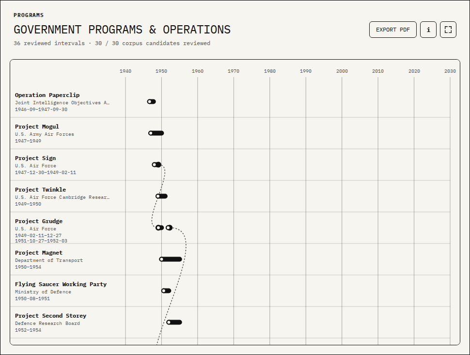</a>
    </td>
  </tr>
  <tr>
    <td width="50%" align="center">
      <strong>Matrix</strong><br>
      <a href="assets/screenshots/matrix.png"></a>
    </td>
    <td width="50%" align="center">
      <strong>Coverage</strong><br>
      <a href="assets/screenshots/coverage.png">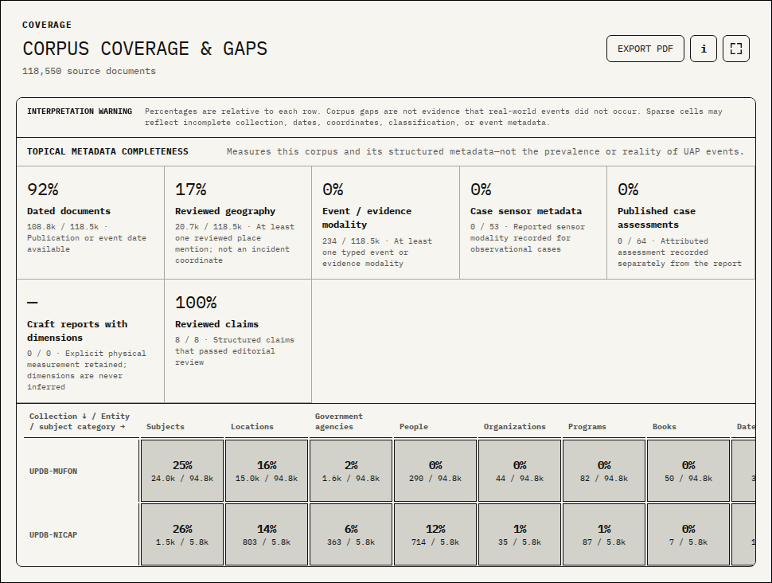</a>
    </td>
  </tr>
  <tr>
    <td width="50%" align="center">
      <strong>Table</strong><br>
      <a href="assets/screenshots/table.png"></a>
    </td>
    <td width="50%" align="center">
      <strong>Triage</strong><br>
      <a href="assets/screenshots/triage.png">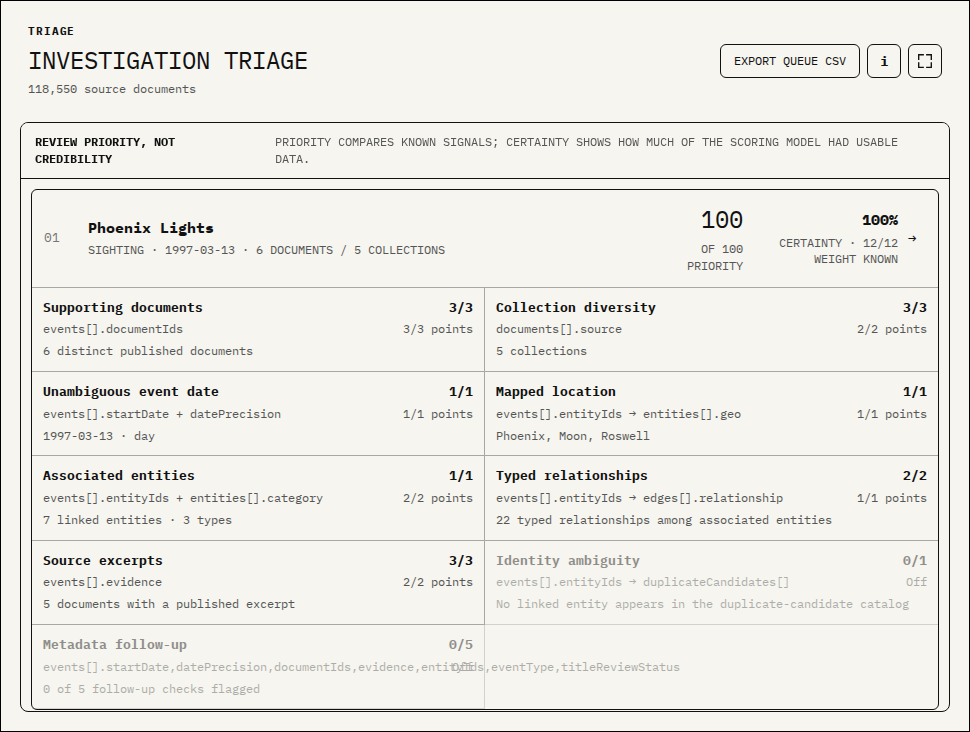</a>
    </td>
  </tr>
  <tr>
    <td width="50%" align="center">
      <strong>Claims</strong><br>
      <a href="assets/screenshots/claims.png">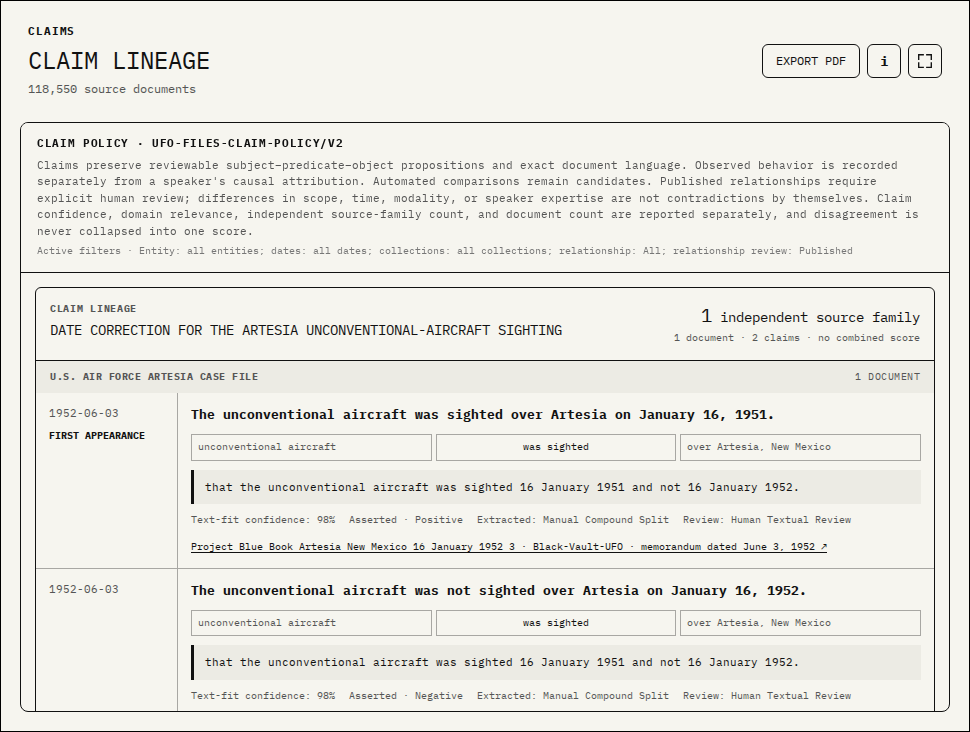</a>
    </td>
    <td width="50%" align="center">
      <strong>Far Side of the Moon</strong><br>
      <a href="assets/screenshots/far-side-moon.png"></a>
    </td>
  </tr>
</table>
<h3>Scatter presets</h3>
<p>Each saved view preset shown in the Scatter graph.</p>
<table>
  <tr>
    <td width="50%" align="center">
      <strong>Default</strong><br>
      <a href="assets/screenshots/scatter-preset-default.png">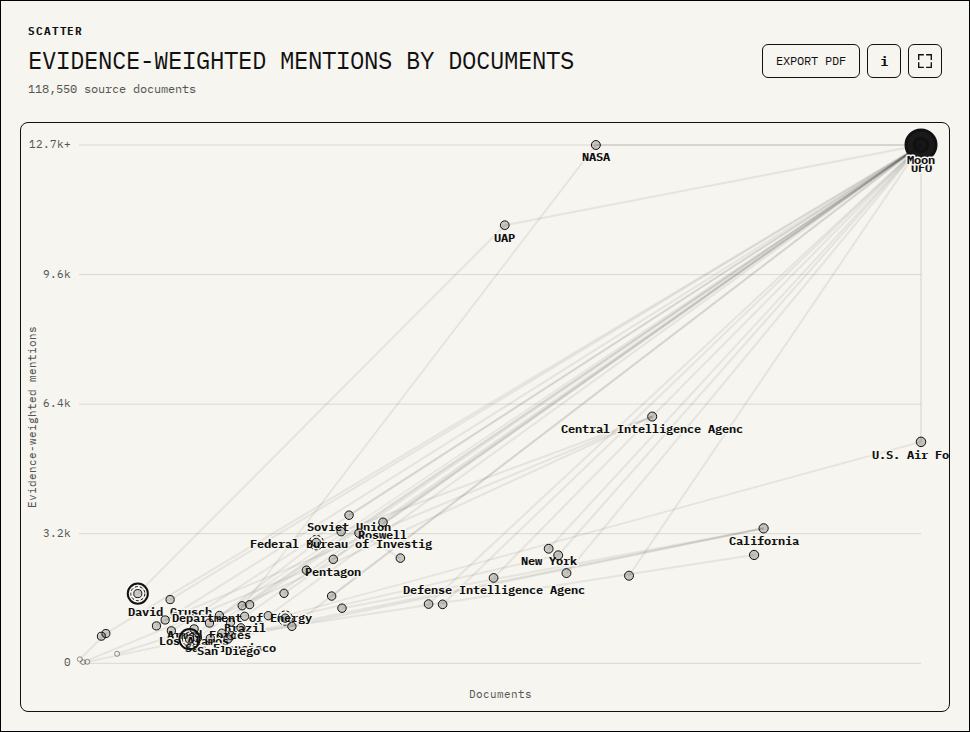</a>
    </td>
    <td width="50%" align="center">
      <strong>Significant People</strong><br>
      <a href="assets/screenshots/scatter-preset-significant-people.png">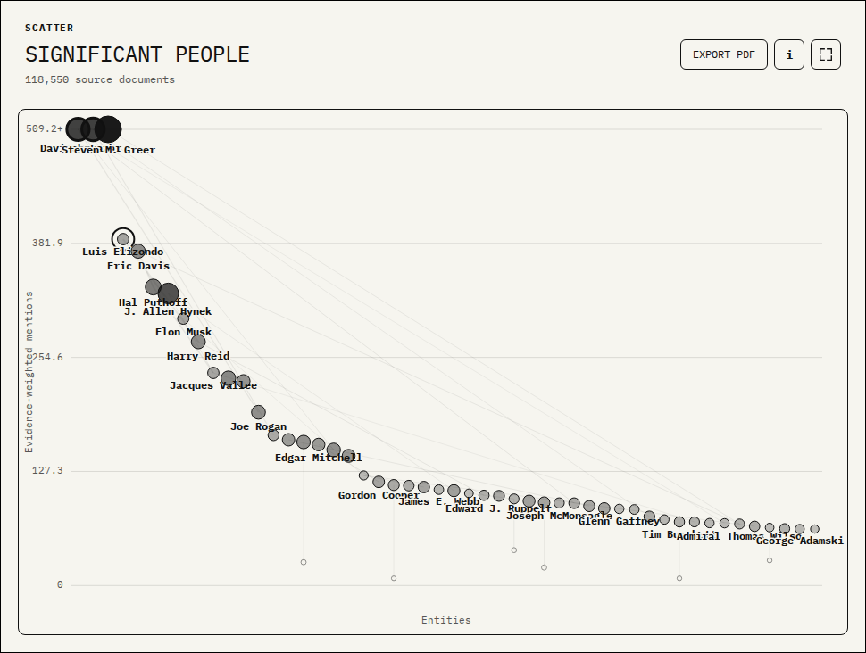</a>
    </td>
  </tr>
  <tr>
    <td width="50%" align="center">
      <strong>Significant Places</strong><br>
      <a href="assets/screenshots/scatter-preset-significant-places.png">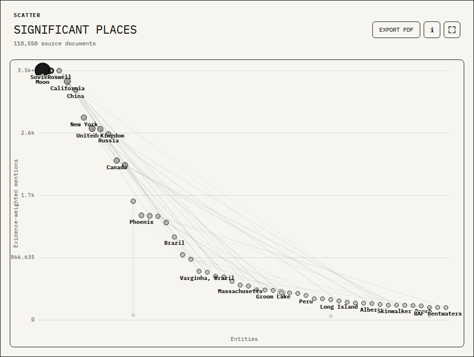</a>
    </td>
    <td width="50%" align="center">
      <strong>Significant Books</strong><br>
      <a href="assets/screenshots/scatter-preset-significant-books.png">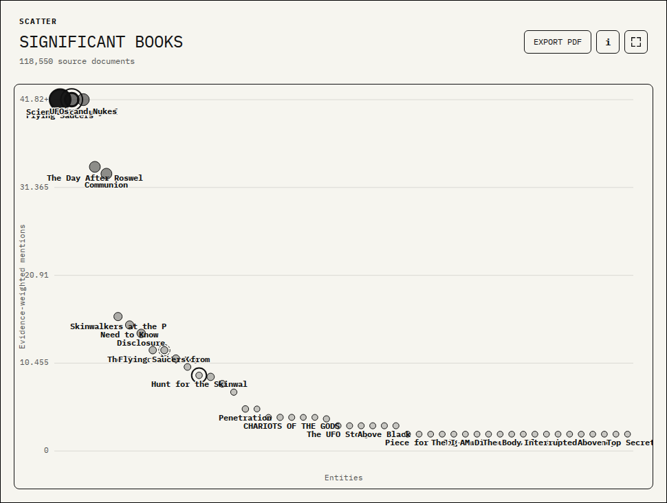</a>
    </td>
  </tr>
  <tr>
    <td width="50%" align="center">
      <strong>Significant Terms</strong><br>
      <a href="assets/screenshots/scatter-preset-significant-terms.png">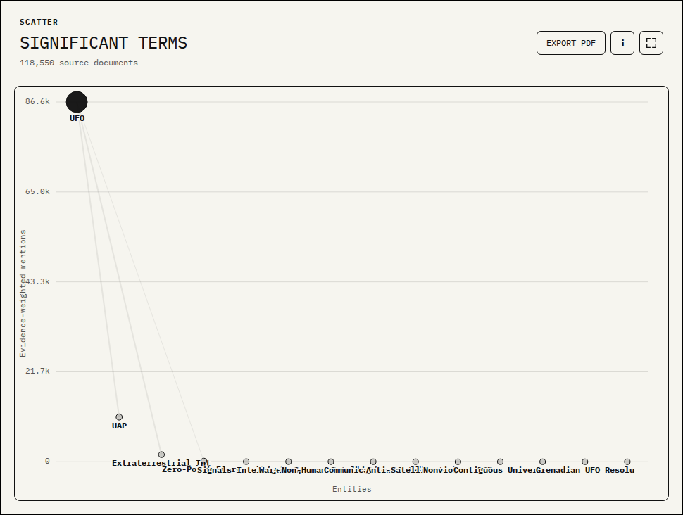</a>
    </td>
    <td width="50%"></td>
  </tr>
</table>
<!-- graph-screenshots:end -->

## Product model

The builder asks for five decisions:

1. **Graph type** — network, map, book, documents, craft, species, signals, scatter, bars, timeline, programs, matrix, coverage, table, triage, or claims.
2. **Data roles** — nodes/relationships or X and Y fields, depending on the shape.
3. **Encoding** — size, monochrome value scales, and labels.
4. **Refinement** — collections, entity types, confidence, evidence floor, and mark count.
5. **Output** — a URL-addressable view, browser save, presentation-ready PDF, or local case dossier.

The default view is a Timeline event sequence and uses the same rendering and data path as every saved view. Presets refine the currently selected graph type instead of replacing it: for example, applying Significant People to Network keeps the network layout and narrows its entities, while applying it to Map keeps the globe selected. Numeric scatter axes use a robust 95th-percentile cap only when the maximum is at least 50% beyond that cap; capped marks stay visible at the plot edge with a heavier outline and retain their exact values in the inspector and tooltip.

The Programs view is review-gated: every displayed row has a public-source-reviewed timeframe, and every entity currently classified as a program in the corpus has an explicit included, merged, or excluded decision. Non-program entities, private efforts, unsupported claims, and duplicate aliases are recorded as reviewed exclusions rather than appearing as undated timeline rows. Curved bridges and endpoint nodes connect reviewed succession or transfer relationships directly between the relevant timeline lanes. Officially documented intervals use solid bars; claims entered into a congressional hearing record use dashed bars and explicitly state that congressional-record provenance is not the same as congressional substantiation or agency confirmation. Open intervals stop at the catalog review date rather than implying an unlimited future duration. Dates, review decisions, and public-source links live in `data/government_programs.json`; loading fails closed if a corpus program candidate lacks a decision.

The Timeline defaults to an event sequence rather than transcription activity. It includes physical incidents—observations, detections, encounters, landings, and crashes—plus source-backed disclosure, hearing, program, publication, and official-report milestones. Every automatically extracted event requires an unambiguous day-level date and explicit surrounding language or a reviewed entry in `data/curated_events.json`; a curated milestone is published only when its cited source document is present. Extracted candidates are public only after receiving a reviewed display title in `data/event_title_reviews.json`, so OCR excerpts remain evidence and never become node labels. Structured MUFON database reports follow a separate conservative date gate: only day-precise, high-confidence report-event metadata from 1947 onward publishes automatically, and source language that says the form date is invalid, forced, uncertain, or otherwise not the actual date holds the report for review. Structured database dates from 1800 through 1946 that are held solely by the modern-reporting baseline appear as hollow historical candidates; they remain explicitly labeled as review-required and are not published events. Malformed dates and records held for any other reason remain absent until an analyst decision is recorded in `data/reported_event_date_reviews.json`. Each analyst decision is bound to the exact reviewed source path and Git blob; month- and year-precision decisions retain that precision in timeline grouping, labels, tooltips, and inspection instead of displaying an invented first day. Reviewed milestones may aggregate independent same-date supporting documents through explicit match terms and allowed semantic kinds. They may also define reviewed `discussionMatchAny` signatures to count local contextual discussions that omit the exact occurrence date; generic term mentions do not qualify. Relative and administrative dates remain excluded. Event time is the X-axis and mention rank is the Y-axis, with rank 1 at the top; equal-strength groups share a rank instead of forming an artificial chronological slope. When the corpus spans both breakpoints, dates before 1938 use the first ten percent of the horizontal range, 1938–2007 uses the next forty percent, and 2007 onward uses the final fifty percent. With the default 500-mark limit, selection first keeps the top 250 month groups by mention strength, preserves priority and earliest events, then fills a per-decade breadth allocation capped at 40 before using global mention strength for any remaining slots. Adjustable horizontal relevance and vertical recency guides cross the full-height plot to form a quadrant-style reading without filtering evidence; when no lower-ranked nodes exist, the relevance split is omitted and the data uses the full plot height. Dark dashed hollow nodes are historical dates awaiting review; all published corpus events use the same solid treatment regardless of source format, with provenance retained in the evidence inspector. The most important event labels appear bottom-centered by default, following the other chart views, and relationship lines connect events only when their supporting evidence shares a specific published person, place, organization, agency, or program; chronological adjacency alone never creates a link. Trusted source metadata and document headers may separately establish a document date. FOIA processing, declassification boilerplate, archive accessions, and OCR or cataloging timestamps remain administrative dates and never position an event. Every accepted or rejected candidate retains its evidence, method, confidence, and semantic kind in `data/date_review.json`; low-confidence and unclassified dates remain review-only.

Claims keep an observation separate from a speaker's explanation for it. In particular, testimony that a phone or computer was "hacked" remains a device anomaly with an unverified compromise attribution unless the source describes a specific autonomous action. A device composing or sending a message without user input can advance to possible intentional control; it still is not a verified intrusion. Verification is reserved for independently reviewed technical or forensic evidence. Relevant professional expertise affects review priority only within that domain and never changes the observation, proves the proposed cause, or becomes a general credibility score. These rules are machine-readable in `data/claims.json` and enforced as part of claim-catalog validation.

Scatter plots, maps, and entity timelines can add a deduplicated relationship layer through Graph Properties. The layer can be off, hover-only, or always visible; it also exposes the strongest-connections limit, evidence floor, relationship type, secondary-node sizing, and line strength. Secondary entities retain their native position and appear only once even when several primary entities connect to them. Maps render elevated globe arcs, while entity timelines connect marks in date/value space. The default shows one strongest connection per node with an always-visible subtle line. These choices persist in saved-view URLs.

Entities are a global data role: they can be network nodes, a Scatter axis, the Bar dimension, Timeline marks, Matrix columns, or Table rows. Network nodes can also be collections, connected by the published entities they share. The Table type also builds custom lists of transcript files and collections with selectable columns, sorting, search, row limits, and evidence inspection. Entity-backed views share the same category, confidence, collection, evidence, label, and publication controls.

Every graph type except Triage exports the same presentation-ready PDF as a one-click download; Triage exports its ranked queue as CSV. The PDF's branded letter-sized cover uses the graph builder's logo and IBM Plex Mono typography, places `ufo-files.app` and `github.com/ufo-files` inline in the header, and identifies the graph title and type, export time, catalog generation time, and machine-data repository and revision. The cover title preserves a custom title supplied by the user, while the View metadata always uses the system-generated name for the active graph configuration. A Graph URL field pairs a full clickable canonical `https://ufo-files.github.io/relationship-graph-builder/` URL with a vector QR code that deep-links to the exact graph configuration captured by the export; default-valued settings are omitted from the URL and restored when it opens. If an unusually large configuration exceeds QR capacity, the full link remains available and PDF generation continues. A readable property section records every filter, encoding, relationship, and limit that applies to the active graph. The following letter-sized page fits the complete presentation stage within the page without cropping or stretching—title, subtitle, graph or table, visible relationship layer, legend, result summary, and evidence-policy detail—on a white background and without interactive controls. The page orientation follows the responsive stage, while the graph retains its live aspect ratio and computed relationship styling. Cover text, metadata, QR code, and SVG graph marks remain sharp vector content; WebGL map pixels remain raster by nature. A PDF-only footer repeats UFO Files provenance, catalog and export timestamps, and the exact machine-data repository revision on the graph page.

The Book type is a contiguous area view of titles explicitly identified in transcript text. The leading title keeps an upright 2:3 book-cover shape, while the remaining mention-weighted blocks flex to fill all available chart space. Their proportions favor near-square blocks for short titles and progressively wider blocks for longer titles so serif cover text wraps legibly. Title type scales with cell area, and cells too small for a complete title remain tooltip-only; shade is controlled independently by the selected prominence metric. Titles are extracted only from book, novel, or memoir cues; each mark opens its source evidence in the inspector.

The Map type renders a rotatable Three.js globe with SVG country boundaries and location-entity nodes. A Moon sized proportionally to Earth follows a time-compressed display orbit at its mean physical distance while keeping its near side tidally locked toward Earth. Animation starts paused and is controlled by Play/Pause beside Export PDF; dragging rotates the complete Earth–Moon system independently. Graph Properties includes a 2–10 second Moon transit control. While any part of the Moon is inside the viewport, its pass is timed to the selected duration and Earth spin is slowed proportionally: 2 seconds retains normal Earth speed and 10 seconds uses 20% speed. Off-screen, Earth resumes a clearly visible 30-second revolution and the Moon completes the hidden half of its orbit in five seconds, bringing the next front- or far-side pass back promptly. The transition frame is clamped to the exact viewport entry boundary so the faster hidden travel cannot jump the Moon into the canvas. A distant telephoto camera outside the lunar orbit preserves Earth’s original centered map scale and keeps the Moon near its familiar apparent size: the Moon starts upper-right on the far side, transits behind Earth, and crosses in front of Earth on the near half-orbit. Whole-body Moon markers stay readable on the camera-facing lunar disk, while selenographic locations remain fixed to their actual surface coordinates. The evidence-backed Far Side of the Moon location is centered on the anti-Earth hemisphere at 0° latitude, 180° longitude, so its node appears during the Moon’s foreground pass and hides when that hemisphere turns away from the camera; projected labels also remain hidden when Earth occludes their 3D nodes. Terrestrial node position comes only from the reviewed `data/location_coordinates.json` gazetteer; ambiguous and unmapped names are reported but never guessed onto the globe. Map nodes retain the same collection, confidence, prominence-inflation, size, label, and evidence-inspection controls as other entity views.

Map interpretation policy: marks are reviewed places mentioned in source documents, not asserted observation or incident coordinates. The gazetteer supplies display coordinates only and ambiguous names remain omitted.

## Galactic Entities scale and astronomical data

Galactic Entities separates three evidence views. The default is the corpus neighborhood: every directly referenced stellar target accepted by the reviewed `data/astronomy_taxonomy.json` rules, shown with the 11,639 high-confidence Gaia DR3 stars at or within 1,000 light-years from the checked-in 30,000-star local sample. This scale covers all 13 reviewed fixed-position corpus targets and keeps their names visible; Solar System entities share one truthful Sun-location marker.

The Milky Way overview remains available as a face-on layered map from the 3,950 published spiral-structure tracers in [Hou & Han (2014)](https://doi.org/10.1051/0004-6361/201424039)—H II regions, giant molecular clouds, and 6.7 GHz methanol masers—plus all 199 VLBI trigonometric-parallax anchors in [Reid et al. (2019)](https://doi.org/10.3847/1538-4357/ab4a11). It directly plots the 3,931 Hou–Han records inside the 18 kpc display radius; 19 farther catalog outliers remain in the checked-in data. Open circles distinguish the Reid layer, and the UI discloses that some objects overlap the earlier compilation. Thin curves reproduce Hou & Han's recommended four-arm logarithmic fit to H II regions, so observations and statistical inference remain visibly distinct. No generated stars, disk fill, hand-drawn bar, bulge, halo, or artistic morphology is present. Dragging orbits either spatial view.

The spiral view uses the Hou–Han `R0 = 8.3 kpc` distance solution as its shared frame. The exact source tables, coordinate transforms, counts, fit equation, catalog DOIs, overlap caveat, and limitations are preserved in `data/milky-way-spiral-tracers-source.txt`, `data/milky-way-vlbi-masers-source.txt`, and `data/milky-way-spiral-fit.json`; the two `scripts/build_milky_way_*.py` utilities reproducibly convert the fixed-width CDS tables. The Gaia observed-sky view retains the official [Gaia EDR3 HEALPix source-count map](https://gea.esac.esa.int/archive/documentation/GEDR3/Catalogue_consolidation/chap_cu9gat/sec_cu9gat_intro/sec_cu9gat_skydensity.html), representing more than 1.8 billion observed sources in Galactic coordinates. Local detail converts referenced targets' reviewed ICRS coordinates and geometric distances into the same coordinate system, reviewed against [SIMBAD](https://simbad.u-strasbg.fr/simbad/). Corpus prominence changes fixed-position target area only, never astronomical position.

The spiral-tracer catalog is a heterogeneous literature compilation, not a uniform or complete census. Its 714 photometric or trigonometric distances are direct literature measurements; the other 3,236 positions use kinematic distances that depend on the adopted rotation curve and ambiguity resolution. The authors explicitly note greater uncertainty on the far side of the Galactic center. The fitted curves are a scientific model of H II positions, not direct measurements or a photograph. The local Gaia point cloud still uses direct inverse positive parallax and is neither complete nor volume-corrected. The sky-density view is observer-centered and affected by dust obscuration, catalogue completeness, and Gaia's scanning procedure. Corpus mention counts appear only as annotation and cannot move an astronomical object.

## Species taxonomy and corpus mentions

Species uses the reviewed, versioned names and six broad groupings in `data/species_taxonomy.json` to find literal extraterrestrial-species references in corpus text. The initial taxonomy was grounded locally with Craig Campobasso's *The Extraterrestrial Species Almanac*; the working transcript is not distributed, and the book is never counted as corpus evidence. Corpus-specific profiles may also be added when a source explicitly characterizes a reported entity, but generic names remain scoped to the reviewed collection and require local supporting language. Potentially related identities remain separate unless the reviewed evidence establishes that they are the same entity. Only a reviewed name or alias can create an observation. Common-language names require explicit extraterrestrial context, and rejected matches remain visible in the ambiguity review queue.

Every published observation retains a stable ID, exact matched phrase, classification confidence, immutable source document ID, collection, excerpt, and same-segment event/entity links. The default lineup uses traced, hand-drawn character reconstructions against a shared height wall. Figure height can represent a reviewed physical-height statement from the local grounding source or square-root-scaled literal name observations; missing physical heights remain visibly unstated and are never inferred. The earlier organic, relationship-aware network remains available as an alternate layout, with node prominence driven by documents, observations, or collections and links for shared source documents. These marks track what the corpus says; neither the counts nor the interpretive character art verify that a described species exists.

## Craft taxonomy and reported dimensions

Craft is always visible in the graph-type picker; the production default remains Timeline, and Craft continues through its reviewed craft-observation data path. The reviewed, versioned taxonomy in `data/craft_taxonomy.json` covers orb/sphere, triangle, pyramid, Tic Tac/capsule, cigar/cylinder, saucer, disc, boomerang/chevron, egg, diamond, cube, and unknown/ambiguous. It also preserves all nine classes in the [Skywatcher UAP Classification Guide](https://skywatcher.ai/research)—Tetra, Tic Tac, Blob, Beam, Manta Ray, Bright Star, Jellyfish, Hornet, and Egg—as the authoritative external coverage baseline. Graph labels use source-neutral craft names; external attribution appears only in the detailed provenance record. The living, preliminary reference profiles remain separate from corpus counts, and a profile with no matching corpus phrase displays zero observations rather than manufacturing evidence. Each corpus observation has a stable ID, its exact matched phrase, explicit-versus-reviewed-synonym status, classification confidence, immutable source document ID, collection, excerpt, and same-segment event/entity links. The review queue retains excluded lexical matches and unmapped shape phrases by decision and example; terms are never silently reassigned to the nearest class.

The build matches only checked-in literal phrases in report-like context. Checked-in exclusions handle ordinary cigars, recorded-media discs, unrelated geometry, object-design references, and bibliography/title-only language. An explicit but unmapped phrase is published under Unknown / ambiguous at low confidence and remains in the review queue. Witness/source-type filters use only explicit same-sentence terms such as pilot, military, law enforcement, or civilian witness; absent wording is labeled unspecified. Location filters use same-segment published location entities, and date filters use a same-segment reviewed event date or the source document date. These links provide investigative context but do not assert that the records describe one verified physical object.

Measurements are extracted only from the sentence owning a single craft classification. Width, height, diameter, length, original number/range, original unit, estimate wording, SI conversion factor, normalized meter value, and the contributing observation are retained. Diameter and length can supply the horizontal annotation with an explicit `reported-…-used-for-width` method; they never create a height. Altitude language such as “at a height of” or “in the sky” is excluded from physical height. Sentences containing multiple craft phrases do not receive measurements automatically. Each displayed mean includes `n`, range and source-level details remain inspectable, and an absent axis is labeled unavailable rather than inferred.

Every craft uses a native monochrome SVG icon governed by `data/craft_icon_briefs.json`: a field-guide system whose silhouettes, documented lights, component ratios, and prohibited details come from corpus evidence or a linked reference profile. The active vector family in `assets/craft-icons/logo` follows the UFO Files logo language: heavy rounded black contours, flat geometry, generous white negative space, and only the minimum structural cutouts needed for recognition. Every SVG has an explicit padded viewBox and contains vector paths only, preventing hulls, rays, and appendages from clipping at graph scale. The original supplied vectors remain intact in the branch history. Every profile uses one uniform black treatment; prominence never changes shade or opacity. Visual motifs are counted from literal source excerpts and linked in the inspector. The icons occupy a radial field: the largest selected prominence value is centered, inner and outer positions descend in rank, and a deliberately broad area scale preserves visible hierarchy between high-, middle-, and low-prevalence forms. Evidence-backed relationship lines render by default behind profiles that co-occur in the same source documents; each profile contributes its strongest shared-document relationship, and profiles without shared documents remain unconnected. Illustration area alone encodes the selected prominence measure; every label and craft retains the same high-contrast black treatment. Every node uses the same document-and-observation count line, while reported physical dimensions remain in the evidence inspector with their sample sizes and unavailable axes. Illustration scale is a prominence encoding, not a physical comparison. Collection, date, location, witness/source type, confidence, and measurement-availability filters recompute the contributing class observations, motif counts, relationships, and dimension means. Craft configurations use the same saved hash, share link, local dossier, and presentation PDF pipeline as the other graph types.

This view summarizes how corpus sources and the externally documented baseline describe reported craft. The taxonomy, drawings, prevalence, and aggregate dimensions are evidence-linked descriptions—not findings that an object exists, that a report is accurate, or that a normalized class is physically verified. The external source describes its taxonomy as living and preliminary; the app treats it as authoritative for coverage and source-attributed profiles, not as independent verification of its hypotheses. Sparse samples and OCR errors can materially affect corpus means; the inspector’s source links, ranges, conversions, and `n` values are the authoritative context for interpreting each mark.

## Signals in the corpus

Signals extracts numeric frequencies from the existing transcript corpus. Explicit Hz, kHz, MHz, and GHz units are retained directly; unit-elided decimal values are normalized as GHz only when the same passage explicitly establishes both frequency or signal language and a microwave-band context. Equivalent forms such as `1.6 GHz` and `1600 MHz` normalize to one frequency while preserving the original phrase, normalization provenance, and source excerpt for inspection. The spectrum-analyzer view places frequencies on a logarithmic radio-frequency axis, shades standard frequency bands, and scales each peak by mentions. Collection filters recompute the peaks from their contributing observations.

These peaks are statements in documents, not measurements from the mobile RF logger or any external signals repository. A frequency mention does not establish that a transmission occurred, that independent sources corroborate it, or that it has an anomalous cause. Technical reports, aviation manuals, interviews, OCR errors, and repeated source material can all contribute mentions; the linked excerpts and document counts are the authoritative context.

## Case dossiers

**Case dossier** opens a browser-local research workspace. Evidence inspectors can add or remove public document, event, entity, craft-class, species-profile, and relationship records without changing the graph. Collection and matrix inspectors add the public records represented by their aggregate. Analysts can classify selections as evidence for, evidence against, or context; record scope, a research question, unresolved questions, metadata gaps, follow-up tasks, review status, and rationale; and capture the exact graph configuration and catalog revision.

The current draft is stored only in browser `localStorage` under `ufo-files-case-dossier`. It is not uploaded. Ordinary graph links and presentation PDFs remain dossier-free. **Copy public link** creates a separate `ufo-files-public-dossier/v1` payload containing only catalog stable IDs, relationship endpoints/types, the catalog revision, and graph configuration. It excludes labels, source links, evidence classification, scope, questions, tasks, status, rationale, and every other analyst annotation. **Export JSON** and **Export neutral report** are explicit downloads and may include local annotations.

JSON imports and exports use `ufo-files-case-dossier/v1`:

```json
{
  "schema": "ufo-files-case-dossier/v1",
  "id": "dossier-YYYYMMDDHHMMSS",
  "createdAt": "ISO-8601 timestamp",
  "updatedAt": "ISO-8601 timestamp",
  "catalog": {
    "schema": "catalog schema",
    "generatedAt": "ISO-8601 timestamp",
    "repository": "owner/repository",
    "revision": "immutable revision"
  },
  "graphConfiguration": {},
  "scope": "local analyst annotation",
  "researchQuestion": "local analyst annotation",
  "records": {
    "documents": [{ "id": "stable ID", "label": "public label", "stance": "supporting|contrary|context", "addedAt": "ISO-8601 timestamp", "sourceLinks": [{ "documentId": "stable ID", "url": "immutable source URL" }] }],
    "events": [],
    "entities": [],
    "crafts": [{ "id": "craft-class-disc", "label": "Disc / disk", "stance": "context", "addedAt": "ISO-8601 timestamp", "sourceLinks": [{ "documentId": "stable source-document ID", "url": "immutable source URL" }] }],
    "species": [{ "id": "species-class-greys", "label": "The Grey Races", "stance": "context", "addedAt": "ISO-8601 timestamp", "sourceLinks": [{ "documentId": "stable source-document ID", "url": "immutable source URL" }] }],
    "relationships": [{ "id": "source|type|target", "source": "stable ID", "target": "stable ID", "relationship": "published type", "label": "public label", "stance": "supporting", "addedAt": "ISO-8601 timestamp", "sourceLinks": [] }]
  },
  "annotations": { "unresolvedQuestions": [], "metadataGaps": [], "followUpTasks": [] },
  "review": { "status": "unreviewed|in_review|needs_follow_up|reviewed", "rationale": "local analyst annotation" }
}
```

Imports reject other schema versions and malformed record groups. The additive `crafts` and `species` groups are optional when loading older v1 dossiers and are written by new exports. Stable IDs absent from the current catalog remain in the dossier and are visibly flagged so a catalog update cannot silently discard prior work. The Markdown report is deterministically ordered, source-linked, revision-specific, and uses neutral language about analyst selection rather than treating selection as verification.

## Run locally

From this directory:

```sh
python3 -m http.server 4173
```

## Entity identity review

Catalog rebuilds apply confirmed identity merges from `data/entity_aliases.json`. Each entry names one canonical entity and the exact aliases—acronyms, OCR variants, possessives, or alternate spellings—that should resolve to it. Non-book registry entries receive exact-case, complete-token matching; entries explicitly marked `matchCaseInsensitively` additionally match case-insensitively, including single-token acronyms. Book aliases still require an explicit title cue. Similar names and broad semantic terms are never merged solely because they look alike.

Every rebuild also writes the complete ranked queue to `data/duplicate_candidates.json` and includes up to 200 candidates in `data/catalog.json` for browser review. In the builder, open **Refine → Review possible duplicates** to inspect the embedded queue. After confirming a pair refers to the same real entity, add the non-canonical spelling to the canonical record in `data/entity_aliases.json`; the next rebuild merges its mentions, documents, evidence, and edges.

Open <http://localhost:4173>.

## Rebuild the catalog

The deployed catalog is built from the public
[`ufo-files/machine-data`](https://github.com/ufo-files/machine-data) repository.
For a local rebuild, clone that repository and pass its path to the builder:

```sh
git clone https://github.com/ufo-files/machine-data.git /tmp/ufo-files-machine-data
python3 scripts/build_catalog.py --input /tmp/ufo-files-machine-data
```

If `--input` is omitted, the builder continues to use `/Volumes/OCR & Transcriptions 1`
for workstation builds. Output is written to `data/catalog.json` by default.

Only files carrying the expected `ufo-files-archive-ocr/v1` or `ufo-files-archive-media-transcripts/v1` metadata schema are included. Hidden operational directories, logs, quarantine, and this app are excluded. Source transcript content is never rewritten or copied; the catalog stores metadata, derived entity records, and short evidence excerpts.

The reviewed identity registry imported from the legacy project is checked in as `data/curated_entities.json`. To refresh it from a legacy checkout:

```sh
python3 scripts/import_legacy_registry.py /path/to/legacy/relationship-graph
python3 scripts/build_catalog.py
```

The map gazetteer in `data/location_coordinates.json` is reviewed against the complete published location queue. Cities and sites use a representative point; countries, states, historical territories, and geographic features use an approximate centroid and declare that coarser precision. Names that are generic, disputed, or ambiguous across multiple real places remain unmapped rather than being guessed onto the globe. The August 2026 audit anchored its highest-profile additions against primary or specialist references, including [IBGE's Varginha geodetic station](https://geoftp.ibge.gov.br/informacoes_sobre_posicionamento_geodesico/rbmc/relatorio/Descritivo_VARG), the [Socorro UFO landing site published by the City of Socorro](https://www.socorronm.gov/locations/socorro-ufo-landing/), [NOAA's RAF Bentwaters station record](https://www.ncei.noaa.gov/pub/data/EngineeringWeatherData_CDROM/engwx/bentwaters_uk.pdf), and the [Australian Department of Defence description of Russell Offices](https://www.defence.gov.au/about/locations-property/base-induction/russell-office).

## Entity and relationship policy

- Curated identity matches take precedence over heuristics.
- Extraction confidence and classification confidence remain separate.
- Unreviewed people require at least three mentions across two documents.
- Book titles require one explicit book, novel, or memoir cue and reserve space in the published catalog.
- Other unreviewed entities require two mentions across two documents; dates require two mentions.
- Generic roles, field labels, document headings, partial phrases, all-caps phrases, and common OCR artifacts are rejected rather than treated as people.
- Typed relationships require both entities and a relation cue in the same segment.
- Generic co-mentions require at least two distinct segments.
- Sections containing more than 30 entities are not expanded into a clique.

Raw mention totals are retained, but entity-backed visualizations use context-adjusted mentions and independent-document counts as their default prominence metrics. The adjustment counts an exact context once per document, counts an exact context repeated across three or more documents once overall, and excludes `Requester:` metadata. Mention adjustment and prominence-inflation risk are separate: ordinary repetition within documents can reduce a mention total, while warning rings require a material loss of independent-document coverage. Each entity includes both rates, risk level, and the contributing repetition signals. Raw metrics remain explicit builder options and table fields. This is a transparent corpus-quality heuristic, not a claim about a person or entity's real-world importance.

The Significant People, Significant Places, and Significant Terms presets exclude high-inflation entities by default. The Refine panel can include them again for inspection; elevated and high-risk scatter points are marked with a dashed ring.

The catalog publishes every accepted explicitly cued book, then fills the remaining slots with the highest-evidence non-book entities within the 1,200-entity payload cap. It publishes up to 4,000 accepted edges. The full accepted and published counts, along with the entity and edge caps, are explicit in the catalog metadata.

## Test

```sh
python3 -m unittest discover -s tests
node --check app.js
node --check map-globe.js
```

For GitHub Pages, publish this directory as the site root. `.nojekyll` is included.

## Automatic updates

Every push to `ufo-files/machine-data` updates `.machine-data-revision` through a
builder-scoped deploy key. That rebuild request immediately starts the `Rebuild
graph from machine-data` workflow, which rebuilds and tests the catalog, records
the exact machine-data commit in the catalog metadata, commits the refreshed
catalog, and deploys the static builder to GitHub Pages. The workflow can also be
run manually or triggered with a `machine-data-updated` `repository_dispatch`
event.

The generated catalog keeps graph-wide entities, relationships, events, cases,
and summaries in `data/catalog.json`. Document records are emitted as compact
source-specific payloads under `data/source-documents/` and loaded before the app
initializes. A source is automatically split into numbered parts before any
payload reaches 80 MiB, leaving margin below GitHub's 100 MB file limit.
Pull requests run every corpus source as an independently named `source / …`
check, plus the full-corpus integration build and browser/Python test suite. This
makes source-specific ingestion failures visible without hiding them inside one
monolithic validation job.

After a completed rebuild, the separate `Refresh README graph screenshots`
workflow captures every top-level graph type, commits the refreshed previews, and
updates the README gallery. It also runs after late rebuild failures in case the
catalog commit completed before deployment failed, runs when screenshot tooling
changes on `main`, and can be started manually. It does not run for pull requests.

## Map data and licenses

The vendored Three.js module is version 0.185.1 and is distributed under the MIT license in `vendor/THREE-LICENSE.txt`. Presentation PDFs use vendored jsPDF 4.2.1 and svg2pdf.js 2.7.0 under their MIT licenses; QR codes use vendored qrcode-generator 1.4.4 under the MIT license in `vendor/QRCODE-GENERATOR-LICENSE.txt`. IBM Plex Mono is embedded in vector PDFs under the SIL Open Font License in `assets/fonts/IBM-PLEX-LICENSE.txt`; source details are in `assets/fonts/README.md`. Country boundaries in `assets/map/world-countries.svg` are generated from Natural Earth’s public-domain 1:110m Admin 0 Countries dataset using `scripts/geojson_to_svg.py`. The Moon surface is a flat grayscale treatment derived from NASA Scientific Visualization Studio’s 2K LRO color map; source and credit details are in `assets/map/moon-texture-source.txt`. The Galactic tracers and arm parameters come from Hou & Han (2014) and Reid et al. (2019) via CDS VizieR; provenance and limitations are documented beside each checked-in dataset. The local 3D stellar sample is from the ESA Gaia DR3 archive and is documented in `data/gaia-dr3-local-stars-source.txt`. The Gaia EDR3 density map is credited to ESA/Gaia/DPAC; its source and deterministic monochrome transformation are documented in `assets/map/gaia-edr3-source-density-source.txt`.
