# UFO Files Graph Builder

A static graph builder for completed OCR and media transcripts in the UFO Files archive. It is designed for GitHub Pages: there is no server, database, CDN dependency, or runtime build step.

## Graph types

These previews are regenerated from the latest machine-data catalog after every successful rebuild. The default view includes the full app chrome, while each graph-type preview focuses on the graph itself. Every image includes a 1px black border for contrast against light backgrounds.

<!-- graph-screenshots:start -->
<p align="center">
  <strong>Default view</strong><br>
  <a href="assets/screenshots/default-view.png">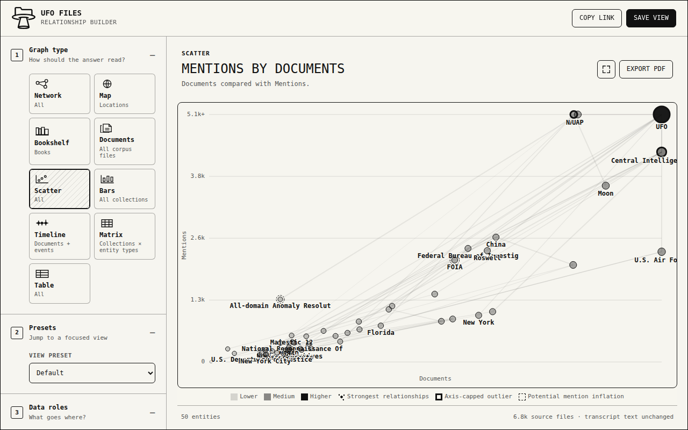</a>
</p>
<table>
  <tr>
    <td width="50%" align="center">
      <strong>Network</strong><br>
      <a href="assets/screenshots/network.png">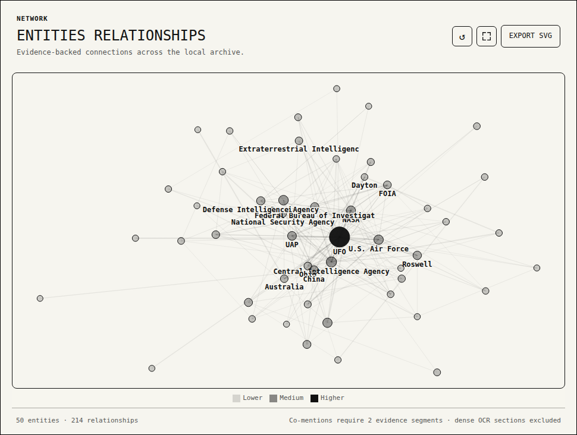</a>
    </td>
    <td width="50%" align="center">
      <strong>Map</strong><br>
      <a href="assets/screenshots/map.png">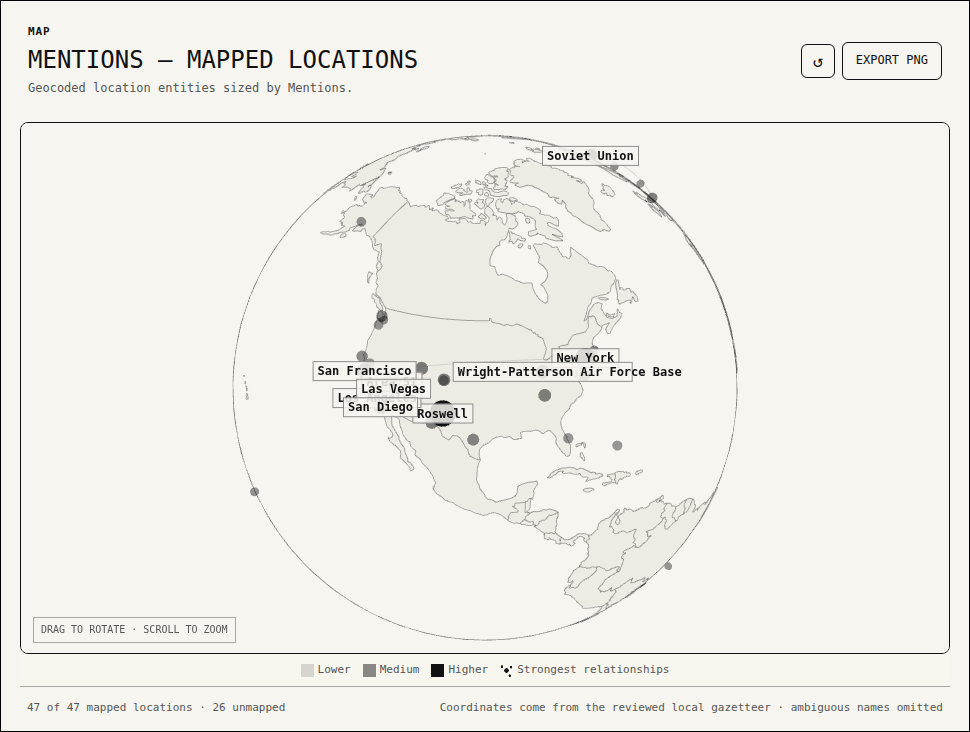</a>
    </td>
  </tr>
  <tr>
    <td width="50%" align="center">
      <strong>Bookshelf</strong><br>
      <a href="assets/screenshots/book.png">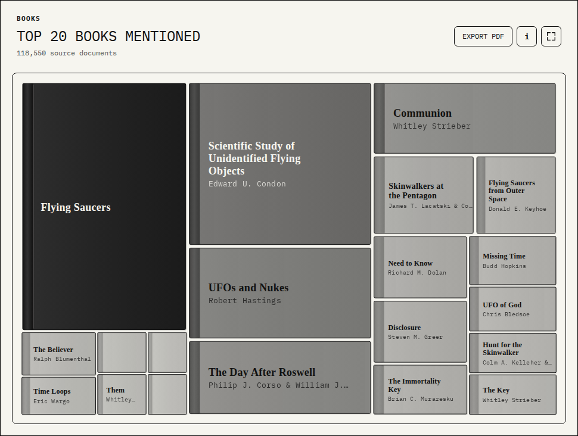</a>
    </td>
    <td width="50%" align="center">
      <strong>Documents</strong><br>
      <a href="assets/screenshots/document.png">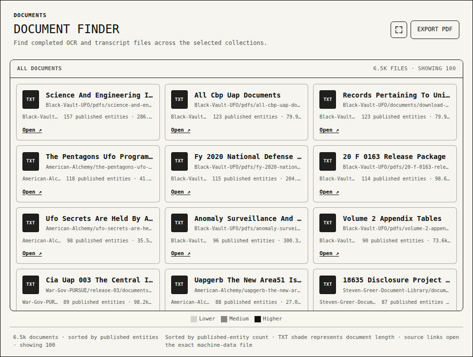</a>
    </td>
  </tr>
  <tr>
    <td width="50%" align="center">
      <strong>Scatter</strong><br>
      <a href="assets/screenshots/scatter.png">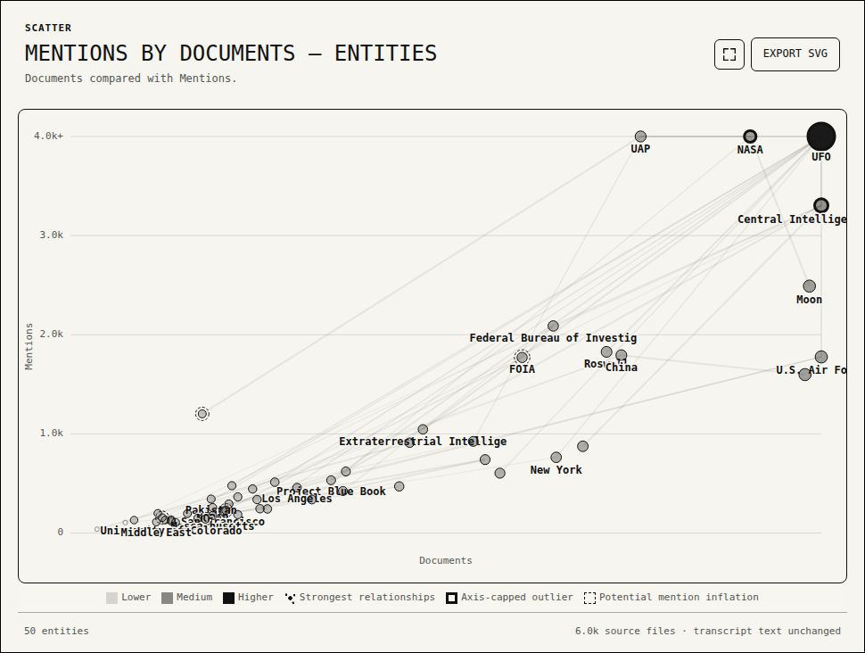</a>
    </td>
    <td width="50%" align="center">
      <strong>Bars</strong><br>
      <a href="assets/screenshots/bars.png">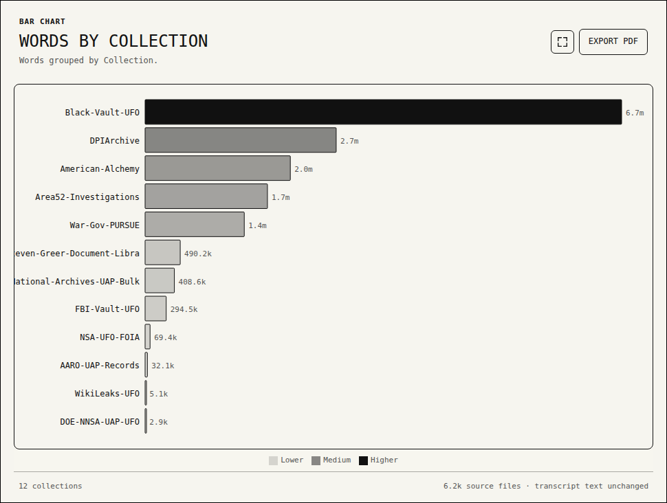</a>
    </td>
  </tr>
  <tr>
    <td width="50%" align="center">
      <strong>Timeline</strong><br>
      <a href="assets/screenshots/timeline.png">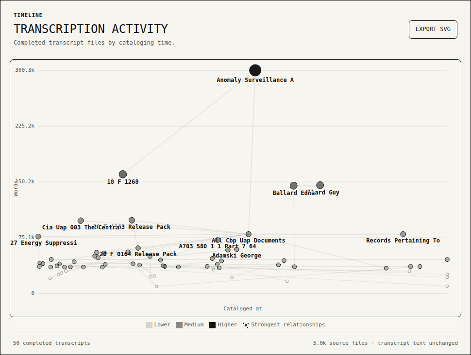</a>
    </td>
    <td width="50%" align="center">
      <strong>Matrix</strong><br>
      <a href="assets/screenshots/matrix.png">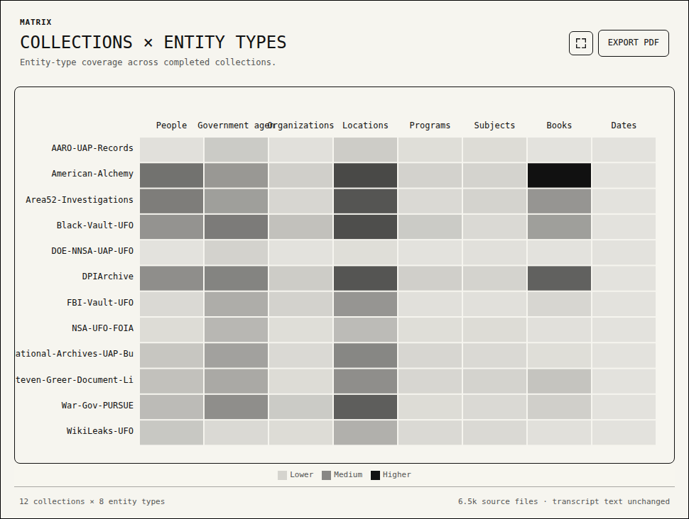</a>
    </td>
  </tr>
  <tr>
    <td width="50%" align="center">
      <strong>Table</strong><br>
      <a href="assets/screenshots/table.png">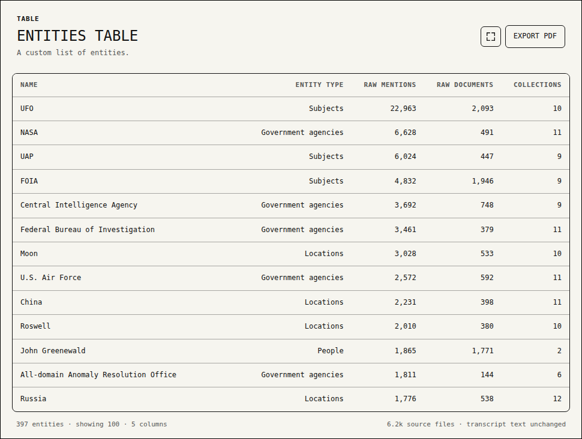</a>
    </td>
    <td width="50%" align="center">
      <strong>Far Side of the Moon</strong><br>
      <a href="assets/screenshots/far-side-moon.png">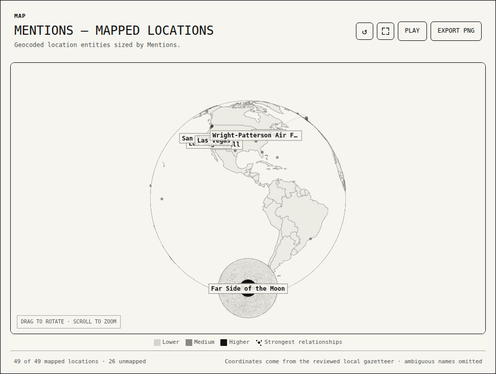</a>
    </td>
  </tr>
</table>
<!-- graph-screenshots:end -->

## Product model

The builder asks for five decisions:

1. **Graph type** — network, map, book, scatter, bars, timeline, matrix, or table.
2. **Data roles** — nodes/relationships or X and Y fields, depending on the shape.
3. **Encoding** — size, monochrome value scales, and labels.
4. **Refinement** — collections, entity types, confidence, evidence floor, and mark count.
5. **Output** — a URL-addressable view, browser save, or presentation-ready PDF.

The default view is an ordinary builder configuration and uses the same rendering and data path as every saved view. Presets refine the currently selected graph type instead of replacing it: for example, applying Significant People to Network keeps the network layout and narrows its entities, while applying it to Map keeps the globe selected. Numeric scatter axes use a robust 95th-percentile cap only when the maximum is at least 50% beyond that cap; capped marks stay visible at the plot edge with a heavier outline and retain their exact values in the inspector and tooltip.

The Timeline defaults to an event sequence rather than transcription activity. An event is published only when an unambiguous day-level date appears in explicit event language such as an observation, detection, encounter, landing, or crash. Trusted source metadata and document headers may separately establish a document date. FOIA requests, releases, declassification notices, archive accessions, and OCR or cataloging timestamps are classified as administrative dates and never position an event. Every accepted or rejected candidate retains its evidence, method, confidence, and semantic kind in `data/date_review.json`; low-confidence and unclassified dates remain review-only.

Scatter plots, maps, and entity timelines can add a deduplicated relationship layer through Graph Properties. The layer can be off, hover-only, or always visible; it also exposes the strongest-connections limit, evidence floor, relationship type, secondary-node sizing, and line strength. Secondary entities retain their native position and appear only once even when several primary entities connect to them. Maps render elevated globe arcs, while entity timelines connect marks in date/value space. The default shows one strongest connection per node with an always-visible subtle line. These choices persist in saved-view URLs.

Entities are a global data role: they can be network nodes, a Scatter axis, the Bar dimension, Timeline marks, Matrix columns, or Table rows. Network nodes can also be collections, connected by the published entities they share. The Table type also builds custom lists of transcript files and collections with selectable columns, sorting, search, row limits, and evidence inspection. Entity-backed views share the same category, confidence, collection, evidence, label, and publication controls.

Every graph type exports the same presentation-ready PDF as a one-click download. Its branded letter-sized cover uses the graph builder's logo and IBM Plex Mono typography, places `ufo-files.app` and `github.com/ufo-files` inline in the header, and identifies the graph title and type, export time, catalog generation time, and machine-data repository and revision. The cover title preserves a custom title supplied by the user, while the View metadata always uses the system-generated name for the active graph configuration. A Graph URL field pairs a full clickable canonical `https://ufo-files.github.io/relationship-graph-builder/` URL with a vector QR code that deep-links to the exact graph configuration captured by the export; default-valued settings are omitted from the URL and restored when it opens. If an unusually large configuration exceeds QR capacity, the full link remains available and PDF generation continues. A readable property section records every filter, encoding, relationship, and limit that applies to the active graph. The following letter-sized page fits the complete presentation stage within the page without cropping or stretching—title, subtitle, graph or table, visible relationship layer, legend, result summary, and evidence-policy detail—on a white background and without interactive controls. The page orientation follows the responsive stage, while the graph retains its live aspect ratio and computed relationship styling. Cover text, metadata, QR code, and SVG graph marks remain sharp vector content; WebGL map pixels remain raster by nature. A PDF-only footer repeats UFO Files provenance, catalog and export timestamps, and the exact machine-data repository revision on the graph page.

The Book type is a contiguous area view of titles explicitly identified in transcript text. The leading title keeps an upright 2:3 book-cover shape, while the remaining mention-weighted blocks flex to fill all available chart space. Their proportions favor near-square blocks for short titles and progressively wider blocks for longer titles so serif cover text wraps legibly. Title type scales with cell area, and cells too small for a complete title remain tooltip-only; shade is controlled independently by the selected prominence metric. Titles are extracted only from book, novel, or memoir cues; each mark opens its source evidence in the inspector.

The Map type renders a rotatable Three.js globe with SVG country boundaries and location-entity nodes. A Moon sized proportionally to Earth follows a time-compressed display orbit at its mean physical distance while keeping its near side tidally locked toward Earth. Animation starts paused and is controlled by Play/Pause beside Export PDF; dragging rotates the complete Earth–Moon system independently. Graph Properties includes a 2–10 second Moon transit control. While any part of the Moon is inside the viewport, its pass is timed to the selected duration and Earth spin is slowed proportionally: 2 seconds retains normal Earth speed and 10 seconds uses 20% speed. Off-screen, Earth resumes a clearly visible 30-second revolution and the Moon completes the hidden half of its orbit in five seconds, bringing the next front- or far-side pass back promptly. The transition frame is clamped to the exact viewport entry boundary so the faster hidden travel cannot jump the Moon into the canvas. A distant telephoto camera outside the lunar orbit preserves Earth’s original centered map scale and keeps the Moon near its familiar apparent size: the Moon starts upper-right on the far side, transits behind Earth, and crosses in front of Earth on the near half-orbit. Whole-body Moon markers stay readable on the camera-facing lunar disk, while selenographic locations remain fixed to their actual surface coordinates. The evidence-backed Far Side of the Moon location is centered on the anti-Earth hemisphere at 0° latitude, 180° longitude, so its node appears during the Moon’s foreground pass and hides when that hemisphere turns away from the camera; projected labels also remain hidden when Earth occludes their 3D nodes. Terrestrial node position comes only from the reviewed `data/location_coordinates.json` gazetteer; ambiguous and unmapped names are reported but never guessed onto the globe. Map nodes retain the same collection, confidence, prominence-inflation, size, label, and evidence-inspection controls as other entity views.

## Run locally

From this directory:

```sh
python3 -m http.server 4173
```

## Entity identity review

Catalog rebuilds apply confirmed identity merges from `data/entity_aliases.json`. Each entry names one canonical entity and the exact aliases—acronyms, OCR variants, possessives, or alternate spellings—that should resolve to it. Similar names are never merged solely because they look alike.

Every rebuild also writes `data/duplicate_candidates.json` and includes the ranked queue in `data/catalog.json`. In the builder, open **Refine → Review possible duplicates** to inspect that queue. After confirming a pair refers to the same real entity, add the non-canonical spelling to the canonical record in `data/entity_aliases.json`; the next rebuild merges its mentions, documents, evidence, and edges.

Open <http://localhost:4173>.

## Rebuild the catalog

The deployed catalog is built from the public
[`ufo-files/machine-data`](https://github.com/ufo-files/machine-data) repository.
For a local rebuild, clone that repository and pass its path to the builder:

```sh
git clone https://github.com/ufo-files/machine-data.git /tmp/ufo-files-machine-data
python3 scripts/build_catalog.py --input /tmp/ufo-files-machine-data
```

If `--input` is omitted, the builder continues to use `/Volumes/OCR & Transcriptions 1`
for workstation builds. Output is written to `data/catalog.json` by default.

Only files carrying the expected `ufo-files-archive-ocr/v1` or `ufo-files-archive-media-transcripts/v1` metadata schema are included. Hidden operational directories, logs, quarantine, and this app are excluded. Source transcript content is never rewritten or copied; the catalog stores metadata, derived entity records, and short evidence excerpts.

The reviewed identity registry imported from the legacy project is checked in as `data/curated_entities.json`. To refresh it from a legacy checkout:

```sh
python3 scripts/import_legacy_registry.py /path/to/legacy/relationship-graph
python3 scripts/build_catalog.py
```

## Entity and relationship policy

- Curated identity matches take precedence over heuristics.
- Extraction confidence and classification confidence remain separate.
- Unreviewed people require at least three mentions across two documents.
- Book titles require one explicit book, novel, or memoir cue and reserve space in the published catalog.
- Other unreviewed entities require two mentions across two documents; dates require two mentions.
- Generic roles, field labels, document headings, partial phrases, all-caps phrases, and common OCR artifacts are rejected rather than treated as people.
- Typed relationships require both entities and a relation cue in the same segment.
- Generic co-mentions require at least two distinct segments.
- Sections containing more than 30 entities are not expanded into a clique.

Raw mention totals are retained, but entity-backed visualizations use context-adjusted mentions and independent-document counts as their default prominence metrics. The adjustment counts an exact context once per document, counts an exact context repeated across three or more documents once overall, and excludes `Requester:` metadata. Mention adjustment and prominence-inflation risk are separate: ordinary repetition within documents can reduce a mention total, while warning rings require a material loss of independent-document coverage. Each entity includes both rates, risk level, and the contributing repetition signals. Raw metrics remain explicit builder options and table fields. This is a transparent corpus-quality heuristic, not a claim about a person or entity's real-world importance.

The Significant People, Significant Places, and Significant Terms presets exclude high-inflation entities by default. The Refine panel can include them again for inspection; elevated and high-risk scatter points are marked with a dashed ring.

The catalog publishes up to 250 explicitly cued books plus the highest-evidence remaining entities, within the 1,200-entity payload cap, and up to 4,000 accepted edges. The full accepted and published counts, along with those caps, are explicit in the catalog metadata.

## Test

```sh
python3 -m unittest discover -s tests
node --check app.js
node --check map-globe.js
```

For GitHub Pages, publish this directory as the site root. `.nojekyll` is included.

## Automatic updates

Every push to `ufo-files/machine-data` updates `.machine-data-revision` through a
builder-scoped deploy key. That rebuild request immediately starts the `Rebuild
graph from machine-data` workflow, which rebuilds and tests the catalog, records
the exact machine-data commit in the catalog metadata, commits the refreshed
catalog, and deploys the static builder to GitHub Pages. The workflow can also be
run manually or triggered with a `machine-data-updated` `repository_dispatch`
event.

After a completed rebuild, the separate `Refresh README graph screenshots`
workflow captures every top-level graph type, commits the refreshed previews, and
updates the README gallery. It also runs after late rebuild failures in case the
catalog commit completed before deployment failed, runs when screenshot tooling
changes on `main`, and can be started manually. It does not run for pull requests.

## Map data and licenses

The vendored Three.js module is version 0.185.1 and is distributed under the MIT license in `vendor/THREE-LICENSE.txt`. Presentation PDFs use vendored jsPDF 4.2.1 and svg2pdf.js 2.7.0 under their MIT licenses; QR codes use vendored qrcode-generator 1.4.4 under the MIT license in `vendor/QRCODE-GENERATOR-LICENSE.txt`. IBM Plex Mono is embedded in vector PDFs under the SIL Open Font License in `assets/fonts/IBM-PLEX-LICENSE.txt`; source details are in `assets/fonts/README.md`. Country boundaries in `assets/map/world-countries.svg` are generated from Natural Earth’s public-domain 1:110m Admin 0 Countries dataset using `scripts/geojson_to_svg.py`. The Moon surface is a flat grayscale treatment derived from NASA Scientific Visualization Studio’s 2K LRO color map; source and credit details are in `assets/map/moon-texture-source.txt`.
